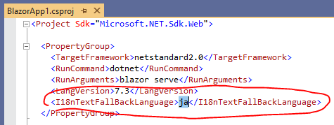
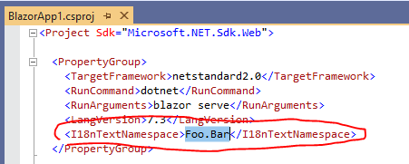

# Blazor Internationalization(I18n) Text [](https://www.nuget.org/packages/Toolbelt.Blazor.I18nText/)

## Summary

This is a NuGet package that allows you to localize texts in your Blazor app.


### Feature

- It works without Server-Side.
- You can develop only plain text editor - No need .resx
- Static Typing - IntelliSense, Code Hint...
- It also works well on Blazor components libraries. 

### Live Demo

- [https://jsakamoto.github.io/Toolbelt.Blazor.I18nText/](https://jsakamoto.github.io/Toolbelt.Blazor.I18nText/)

## Quick Start

### Step.1 - Add "Toolbelt.Blazor.I18nText" Package

Add `Toolbelt.Blazor.I18nText` NuGet package to your Blazor app project.

If you are using dotnet CLI, you can do it by command line bellow.

```
$ dotnet add package Toolbelt.Blazor.I18nText
```

You can also do it in Package Manager Console of Visual Studio, if you are using Visual Studio in Windows OS.

```
PM> Install-Package Toolbelt.Blazor.I18nText
```

### Step.2 - Create localized text source files as JSON or CSV

Add localized text source files for each language in a `i18ntext` folder under  your Blazor app project folder.

The localized text source files must be simple key-value only JSON file like a bellow example,

```json
{
  "Key1": "Localized text 1",
  "Key2": "Localized text 2",
  ...
}
```

or, 2 coulmn only CSV file without header row like a bellow example.

```
Key1,Localized text 1
Key2,Localized text 2
```

**NOTICE** - The encoding of CSV file must be **UTF-8**.


And, the naming rule of localized text source files must be bellow.

```
<Text Table Name>.<Language Code>.{json|csv}
```


### Step.3 - Build the project always when localized text source files are created or updated.

After creating or updating those localized text source files, **you have to build your Blazor app project.**

After building the project, **"Typed Text Table class" C# files** will be generated in the `i18ntext/@types` folder, by the building process.

And also, **"Localized Text Resource JSON" files** will be generated at the `wwwroot/content/i18ntext` folder, too.


**NOTE** - If you want to do this automatically  whenever those localized text source files (.json or .csv) are changed, you can use `dotnet watch` command with following arguments.

```shell
$ dotnet watch msbuild -t:CompileI18nText
```

After entry this dotnet CLI command, dotnet CLI stay in execution state and watch the changing of localized text source files. If it detect the changing of localized text source files, then the dotnet CLI re-compile localized text source files into **"Typed Text Table class"** files and **"Localized Text Resource JSON" files**.


### Step.4 - Configure your app to use I18nText service

Open the C# source file of the "Startup" class of your Blazor app in your editor, and add `using` clause for opening `Toolbelt.Blazor.Extensions.DependencyInjection` namespace, and add following code in `ConfigureServices()` method of the startup class.

```csharp
services.AddI18nText<Startup>();
```


### Step.5 - Get the "Text Table" object in your Blazor component

Open your Blazor component file (.cshtml) in your editor, and do this:

1. Inject `Toolbelt.Blazor.I18nText.I18nText` service into the component.

```csharp
@inject Toolbelt.Blazor.I18nText.I18nText I18nText
```

2. Add a filed of the Text Table class generated from localized text source files, and asign the default instance.

```csharp
@functions {

    I18nText.MyText MyText = new I18nText.MyText();
```

**NOTE** - The namespace of the Text Table class is `<default namespace of your Blazor project>` + `"I18nText"`.

3. Override `OnInitAsync()` method of the Blazor component, and asign a Text Table object that's a return value of `GetTextTableAsync<T>()` method of `I18nText` service instance to the Text Table field.

```csharp
protected override async Task OnInitAsync()
{
  MyText = await I18nText.GetTextTableAsync<I18nText.MyText>(this);
```


### Step.6 - Use the Text Table

After doing the these steps, you can reference a field of the Text Table object to get localized text.

If you are using Visual Studio in Windows OS and Blazor extensions is installed in that Visual Studio, you can get "IntelliSense" and "Document comment" support.


**_Note:_** Text Table object allows you to get localized text by key string dynamically, with indexer syntax, like this.

```html
<h1>@MyText["HelloWorld"]</h1>
```

This way is sometimes called "late binding".

This feature is very useful in some cases.  
However, if you make some mistakes that typo of key string, these mistakes will not be found at compile time. 
In this case, it will just return the key string as is without any runtime exceptions.

### Step.7 - Run it!

Build and run your Blazor app.

The I18nText service detects the language settings of the Web browser, and reads the localized text resource JSON which is most suitable for the language detected.


## Limitations

The following features are not supported in this version of `I18Text` library.

- Plural form support
- Text formatting by place holder. (You can use `System.String.Format(...)` instead.)
- Integration with `System.Globalization.Culture.CurrentUICulture`.

The following features will not be supported forever, because these features are not the scope of this library, I think.

- Formatting of date, time, currency. (These features will be provided by `System.Globalization.Culture`.)

## Configuration

### Fallback language

Fallback language is determined at compile time.

The default fallback language is `en`.

If you want to change the fallback language, edit your project file (.csproj) to add `<I18nTextFallBackLanguage>` MSBuild property with the language code what you want.



### The namespace of the Text Table class

If you want to change the namespace of the Text Table classes that will be generated by the building process, edit your project file (.csproj) to add `<I18nTextNamespace>` MSBuild property with the namespace what you want.



## API Reference

### I18nText service class

#### namespace

Toolbelt.Blazor.I18nText


#### GetCurrentLanguageAsync method

##### Syntax

```csharp
public Task<string> GetCurrentLanguageAsync();
```

##### Description

This method returns the language code of the current selecting in the `I18nText` service instance.

That language code is what detected from the Web browser settings, or specified by an argument of last `SetCurrentLanguageAsync()` method call.

`GetTextTableAsync<T>(...)` method uses the language code that this method returns to determine which language resource file should load.

#### SetCurrentLanguageAsync method

##### Syntax

```csharp
public Task<string> SetCurrentLanguageAsync(string langCode);
```

##### Description

This method changes the language code of current selecting in the I18nText service instance.

In the default configuration, the language code that passed to the argument of this method will stored in session storage of the web browser. 

The language code that was stored by this method will be read at launching the Blazor app, and used to initialize the `I18nText` service instance.

If you want to change this storing behavior, you can configure it at service registration (see also: `AddI18nText<T>(...)` extension method.).

#### GetTextTableAsync method

##### Syntax

```csharp
public Task<T> GetTextTableAsync<T>(ComponentBase component);
```

##### Description


This method returns the "Text Table" object specified with type argument `T`.
The type `T` is the class auto generated from localized text source file in the building process.

The fields of "Text Table" object are initialized by Localized Resource Text JSON file which is most suitable for the language code returned by the `GetCurrentLanguageAsync()` method.

When the `SetCurrentLanguageAsync(...)` method is invoked and current language of the `I18nText` service instance is changed, `StateHasCahnged()` method of the component that is specified to the 1st argument of this method will be invoked automatically.  
By this effect, the result of rendering Blazor component will be refreshed with the after changed language's localized text.

### I18nTextDependencyInjection class

#### namespace

Toolbelt.Blazor.Extensions.DependencyInjection

#### AddI18nText extension method

##### Syntax

```csharp
public static IServiceCollection AddI18nText<TStartup>(
  this IServiceCollection services,
  Action<I18nTextOptions> configure = null);
```

#### Description

This extension method registers `I18nText` service into .NET Core DI (Dependency Injection) system.

You can customize the behavior of `I18nText` service in `configure` callback function.

### I18nTextOptions class

#### namespace

Toolbelt.Blazor.I18nText

#### GetInitialLanguageAsync field

##### Syntax

```csharp
public GetInitialLanguage GetInitialLanguageAsync;
```

##### Description

This field defines the behavior of how to get a initial language code when the Blazor app loaded first.

The type of this field is a delegate that has following syntax.

```csharp
public delegate Task<string> GetInitialLanguage(I18nTextOptions options);
```

By the default configuration, this field points to the static method that implements default behavior.  
The default implements will return the language code from the web browser's local or session storage that would be stored by `SetCurrentLanguageAsync(...)` method, or web browser's language settings if the storage is empty.

#### PersistCurrentLanguageAsync field

#### Syntax

```csharp
public PersistCurrentLanguageAsync PersistCurrentLanguageAsync;
```

##### Description

This field defines the behavior of how to persist the current language selecting in the `I18nText` service instance, when the `SetCurrentLanguageAsync(...)` method is invoked.

The type of this filed is a delegate that has following syntax.

```csharp
public delegate Task PersistCurrentLanguageAsync(
  string langCode,
  I18nTextOptions options);
```

By the default configuration, this field points to the static method that will or will not store the language code that is specified for the argument of the delegate.  
The behavior of the default implements rely on what value is specified in the`PersistanceLevel` filed of the `option` argument.

#### PersistanceLevel field

##### Syntax

```csharp
public PersistanceLevel PersistanceLevel;
```

##### Description

This enum field allows you to control which storage is used for storing the current language selecting when the `SetCurrentLanguageAsync(..)` method is invoked.

The type of this field is a enum type that has following values, and this field has one of the these enum values.

```csharp
public enum PersistanceLevel
{
  None,
  Session,
  SessionAndLocal
}
```

These enumerated values ​​have the following meanings.

- **None** ... the language code will not persist anywhere.
- **Session** ... the language code will persist into web borwser's session storage.
- **SessionAndLocal** ... the language code will persist into web borwser's session storage and local storage.

This field value is used by the static method that is the default value of `PersistCurrentLanguageAsync` field.

## License

[Mozilla Public License Version 2.0](https://github.com/jsakamoto/Toolbelt.Blazor.I18nText/blob/master/LICENSE)
