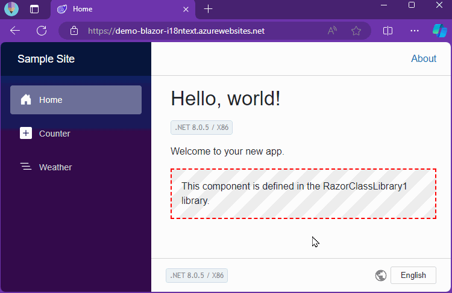

# Blazor Internationalization(I18n) Text [](https://www.nuget.org/packages/Toolbelt.Blazor.I18nText/)

## Summary

This is a NuGet package that provides the feature of localization texts in your Blazor app.



## Quick Start

### Step.1 - Add "Toolbelt.Blazor.I18nText" Package

Add `Toolbelt.Blazor.I18nText` NuGet package to your Blazor app project.


```
$ dotnet add package Toolbelt.Blazor.I18nText
```

```
PM> Install-Package Toolbelt.Blazor.I18nText
```

### Step.2 - Create localized text files as JSON

Add localized text files for each languages in `i18ntext` folder under  your Blazor app project folder.

The localized text files must be simple key-value only JSON file like bellow,

```json
{
  "Key1": "Localized text 1",
  "Key2": "Localized text 2",
  ...
}
```

and the file names of localized text files must be bellow.

```
<Text Table Name>.<Language Code>.json
```


### Step.3 - Build everytime after create or update localized text files.

After creating those localized text files, **build your Blazor app project.**

After build, **"Typed text table class" C# files** will be generated in `i18ntext/@types` folder, by build process.

And alos, **localized text resource json files** will be generated in  `wwwroot/content/i18ntext` folder, too.


**NOTE** - If you wnat to do this automatically, you can use `dotnet watch` command with following arguments.

```shell
$ dotnet watch msbuild -t:CompileI18nText
```

After entry this dotnet CLI command, dotnet CLI stay in execution state and watch the changing of localized text files. If it detect the changing of localized text files, then the dotnet CLI re-compile localized text files into text table class and localized resouce JSON files.


### Step.4 - Configure your app to use I18nText service

Open startup class of your Blazor app in your editor, and add following code in `ConfigureServices()` method of your startup class, with opening `Toolbelt.Blazor.Extensions.DependencyInjection` namespace.

```csharp
services.AddI18nText<Startup>();
```


### Step.5 - Get the text table in your Blazor component

Open your Blazor component (.cshtml) in your editor, and do this:

1. Inject `Toolbelt.Blazor.I18nText.I18nText` service to the component.

```csharp
@inject Toolbelt.Blazor.I18nText.I18nText I18nText
```

2. Add the filed of text table class which is generated from localized text JSON files, and asign default instance.

```csharp
@functions {

    I18nText.MyText MyText = new I18nText.MyText();
```

**NOTE** - The namespace of the text table class is default namespace of your Blazor project + "I18nText".

3. Override `OnInitAsync()` method, and asign text table object that's a return value of `GetTextTableAsync()` method of `I18nText` service instance to the text table field.

```csharp
protected override async Task OnInitAsync()
{
  MyText = await I18nText.GetTextTableAsync<I18nText.MyText>(this);
```


### Step.6 - Use the text table

After do the these steps, you can use text table object to get localized text.

If you use Visual Studio and Blazor language extension, then you will be aimed with "intelliSense" and "Document comment" support.


### Step.7 - Run it!

Build and run your Blazor app.

The I18nText service detect language settings of the Web browser, and load localized text resource JSON which is more better one.


## Configuration

### Fallback language

Fallback language is decided at compile time.

The default fallback language is `en`.

If you want to change the fallback language, edit your project file (.csproj) to add `<I18nTextFallBackLanguage>` MSBuild property with the language code you want.


### The namespace of the text table class

If you want to change the namespace of the text table class which are generated by build proecess, edit your project file (.csproj) to add `<I18nTextNamespace>` MSBuild property with the namespace you want.


## License

[Mozilla Public License Version 2.0](LICENSE)
